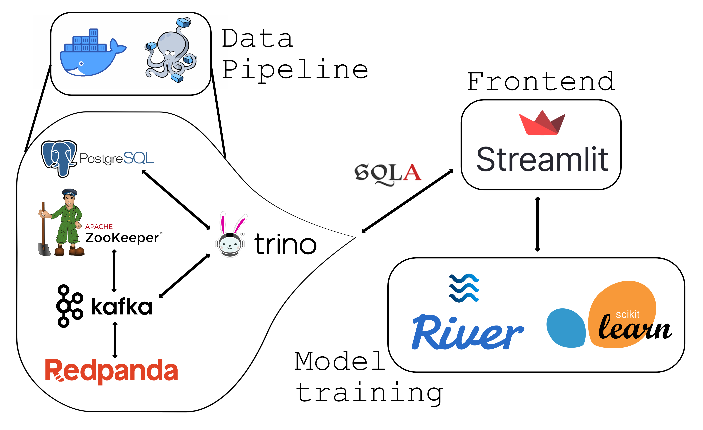

# power-anomaly-detection
This is an anomaly detection project using mock power data (voltage time series).
- mock data was created using a random forest regressor with a lag of 1 trained on real power data from smart meters 
- this mock data is streamed using Kafka to Trino
- trained models attempt to identify anomalies based on this batched Trino data
- and the predicted anomalies are inserted into a postgresql table 
- a streamlit frontend is included to see the continuous time series data and,
- to insert anomalies to test the detection algorithms.

For a more in depth explanation see the following [blog post](https://www.cinqict.nl/blog/realtime-anomaly-detection-with-trino).

## Pipeline

## Setup
- `pip install -r requirements.txt`
- `docker-compose up -d`
- `docker exec -it power-anomaly-detection-kafka-1 bash` - enter the kafka container
- `cd /opt/bitnami/kafka/bin`
- `kafka-topics.sh --create --topic power.power_data --bootstrap-server localhost:9093`
- (Optional) `kafka-console-consumer.sh --topic power.power_data --from-beginning --bootstrap-server localhost:9093` - check if data is in the topic
- `exit` - exit the kafka container
- create the necessary tables in postgres
    - `python connection_sandbox_postgres.py`

## Run
- `python main.py`

## Extras
- check what ports are in use: `sudo lsof -i -P -n | grep LISTEN`
- kill a process: `sudo kill -9 <PID>`
